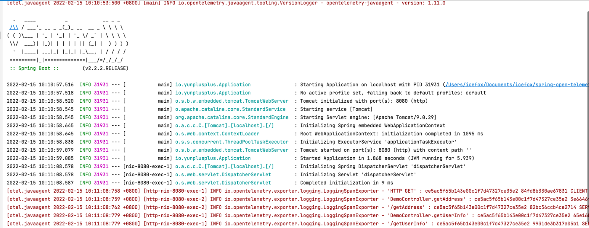

## open-telemetry agent 配置

此代理是高度可配置的.

一个选择是通过-D标志传递配置属性,在这个例子中展示如何让配置服务名称和zipkin exporter:

```shell
java -javaagent:path/to/opentelemetry-javaagent.jar \
     -Dotel.service.name=your-service-name \
     -Dotel.traces.exporter=zipkin \
     -jar myapp.jar
```

你也能用环境变量来配置agent：

```shell
OTEL_SERVICE_NAME=your-service-name \
OTEL_TRACES_EXPORTER=zipkin \
java -javaagent:path/to/opentelemetry-javaagent.jar \
     -jar myapp.jar
``` 

你也能提供一个Java properties文件,加载配置属性值：

```shell
java -javaagent:path/to/opentelemetry-javaagent.jar \
     -Dotel.javaagent.configuration-file=path/to/properties/file.properties \
     -jar myapp.jar
```

or

```shell
OTEL_JAVAAGENT_CONFIGURATION_FILE=path/to/properties/file.properties \
java -javaagent:path/to/opentelemetry-javaagent.jar \
     -jar myapp.jar
```

### Jeager exporter

Jaeger exporter通过grpc协议来交互。

| 系统属性                   | 环境变量             | 描述                                                                                        |
|-----------------------------------|-----------------------------------|----------------------------------------------------------------------------------------------------|
| otel.traces.exporter=jaeger       | OTEL_TRACES_EXPORTER=jaeger       | 选择 Jaeger exporter                                                                         |
| otel.exporter.jaeger.endpoint     | OTEL_EXPORTER_JAEGER_ENDPOINT     | The Jaeger gRPC endpoint to connect to. Default is `http://localhost:14250`.                       |
| otel.exporter.jaeger.timeout      | OTEL_EXPORTER_JAEGER_TIMEOUT      | The maximum waiting time, in milliseconds, allowed to send each batch. Default is `10000`.         |

```shell
java -javaagent:/Users/icefox/Documents/OpenTelemetry/opentelemetry-javaagent-v.1.11.0.jar \
     -Dotel.javaagent.configuration-file=/Users/icefox/Documents/icefox/spring-open-telemetry/config/agent-jaeger.properties \
     -jar myapp.jar
```

### Zipkin exporter

它将[Zipkin format](https://zipkin.io/zipkin-api/#/default/post_spans) 的JSON发送到指定的HTTP URL。

| 系统属性               | 环境变量      |  描述                                                                                                                |
|-------------------------------|-------------------------------|-----------------------------------------------------------------------------------------------------------------------|
| otel.traces.exporter=zipkin   | OTEL_TRACES_EXPORTER=zipkin   | Select the Zipkin exporter                                                                                            |
| otel.exporter.zipkin.endpoint | OTEL_EXPORTER_ZIPKIN_ENDPOINT | The Zipkin endpoint to connect to. Default is `http://localhost:9411/api/v2/spans`. Currently only HTTP is supported. |

```shell
java -javaagent:/Users/icefox/Documents/OpenTelemetry/opentelemetry-javaagent-v.1.11.0.jar \
     -Dotel.javaagent.configuration-file=/Users/icefox/Documents/icefox/spring-open-telemetry/config/agent-zipkin.properties \
     -jar myapp.jar
```

### Logging exporter

logging exporter打印span及其属性到stdout,它主要用于测试和调试。

| 系统属性                  | 环境变量           | 描述                                                            |
|-------------------------------|-------------------------------|----------------------------------------------------------------------|
| otel.traces.exporter=logging  | OTEL_TRACES_EXPORTER=logging  | Select the logging exporter for tracing                              |
| otel.metrics.exporter=logging | OTEL_METRICS_EXPORTER=logging | Select the logging exporter for metrics                              |
| otel.logs.exporter=logging    | OTEL_LOGS_EXPORTER=logging    | Select the logging exporter for logs                                 |
| otel.exporter.logging.prefix  | OTEL_EXPORTER_LOGGING_PREFIX  | An optional string printed in front of the span name and attributes. |

```shell
java -javaagent:/Users/icefox/Documents/OpenTelemetry/opentelemetry-javaagent-v.1.11.0.jar \
     -Dotel.javaagent.configuration-file=/Users/icefox/Documents/icefox/spring-open-telemetry/config/agent-logging.properties \
     -jar myapp.jar
```



### 故障问题排查

你向agent添加 -Dotel.javaagent.debug=true 参数来查看debug日志。请注意，这些内容非常冗长。

```shell
-Dotel.javaagent.debug=true 
```

TransmittableThreadLocal (TTL)

```shell
-Xbootclasspath/a:/Users/icefox/Documents/github/yunplusplus/spring-open-telemetry-samples/lib/transmittable-thread-local-2.12.4.jar
```
### 传播格式

zikpin  [b3-propagation](https://github.com/openzipkin/b3-propagation) \
jaeger  [propagation-format](https://www.jaegertracing.io/docs/1.31/client-libraries/#propagation-format) \
w3c     [trace-context](https://github.com/w3c/trace-context)